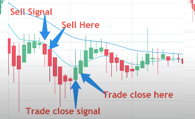
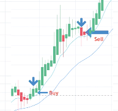

# heikin_ashi_ema_strategy

https://www.youtube.com/watch?v=_NrhISmPMLg

This strategy is based on above video. The Trading idea and rules is described in above video. credit should go to him

In here first it find the trend on 4 hour time frame. long and short decison are biased accounting to that trend.

After it find the indecision candle on 1 hour time frame on Heikin Ashi candlesticks  

for short signal generated, when Bearish Heikin Ashi candle generated after a  indecision candle in downtrend

for long signal generated, when bullish Heikin Ashi candle generated after a  indecision candle in uptrend

